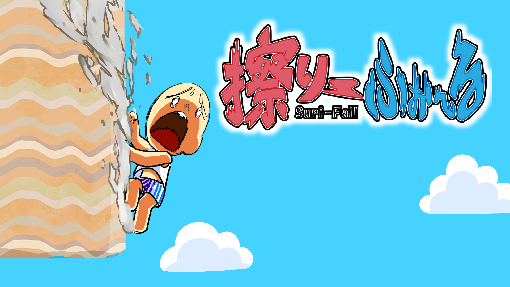

# コウゲイゲームジャム2024制作作品
__タイトル名：『擦りーふぉーる』(Suri-Fall)__

# 作品紹介

__男が突然フリーフォール！死なないように壁をこすって海面に着水しろ！！__

男の人が突然空間から落下し始めます。周辺には障害物があり叩き付けられると死んでしまいます。

そこで、障害物の側面を擦って減速しながら海面を目指すゲームです。

__ダウンロード__

URL (Windows)： https://github.com/saeki7036/GameJam_2024_G/releases/download/Var1.0.4/Var1_0_4.zip

圧縮ファイル内のsrc.exeを起動して遊べます。
# ゲームについて
__操作方法__

タイトル画面
* エンターキー：ゲーム開始
* スペースキー：クレジット表記

メインゲーム画面
* A/Dキー,左矢印/右矢印キー：移動
* 移動中に降ってくる障害物に擦れる：擦り状態
* Rキー：リトライ
* ESCキー：終了

__プレイ動画__
https://saeki7036.github.io/GameJam_2024_G/src/Assets/Movie/M_01.mp4

# 製作情報
作品テーマ課題：『痛い』

製作期間：二日

製作メンバー：6人

・プランナー：1名

・デザイナー：3名

・プログラマ：2名

# サウンドクレジット表記(敬称略)

* ポケットサウンド

https://pocket-se.info/
* 効果音ラボ

https://soundeffect-lab.info/
* DOVA-SYNDROME『Spear』shimtone

https://dova-s.jp/_contents/agreement/
* にゃるぱかBGM工房『走りだせ世界』

https://nyalpaca.booth.pm/

